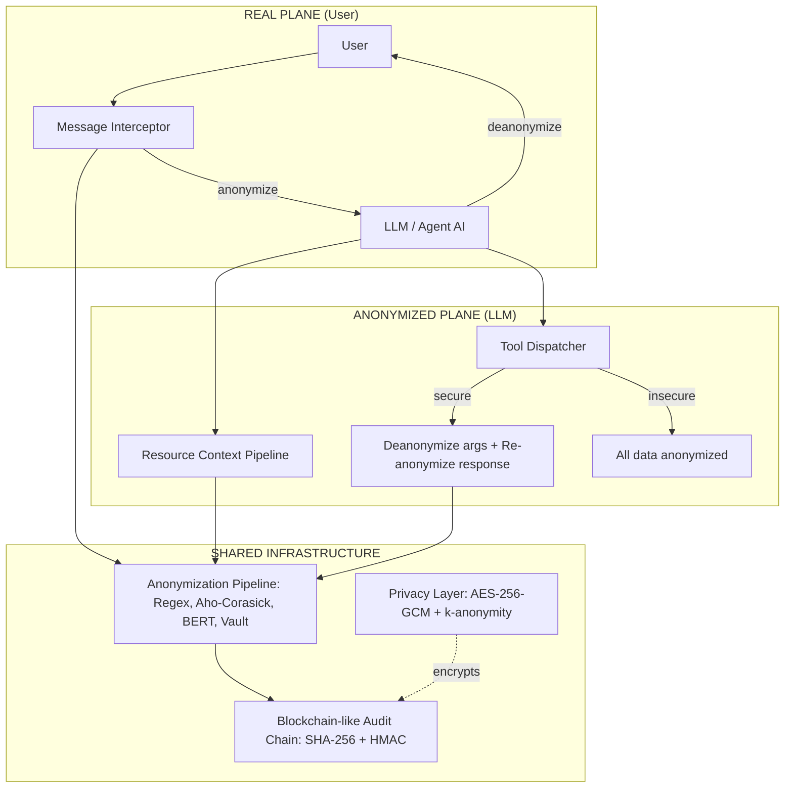
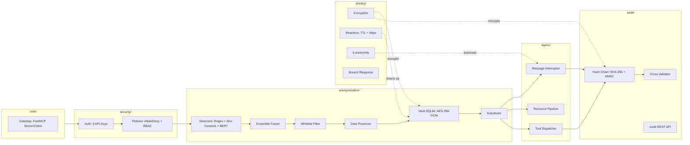
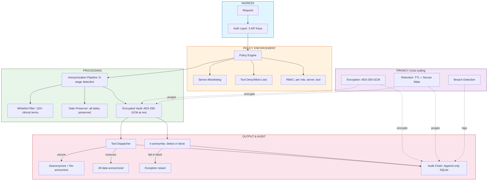

# uMCP — Unified MCP Security Framework

**uMCP is a privacy-preserving security framework for AI agents built on the Model Context Protocol (MCP), providing transparent dual-plane anonymization, blockchain-like audit trails, and plug-and-play tooling for healthcare, finance, and other regulated domains.**

[](LICENSE)
[](pyproject.toml)


[]([https://doi.org/XXXX](https://doi.org/10.5281/zenodo.20588797))

---

## Overview

uMCP introduces a dual-plane architecture where the user operates in a "real" plane (seeing actual personal data) while the LLM operates exclusively in an "anonymized" plane (receiving only de-identified surrogates). A transparent message interceptor anonymizes user input before it reaches the LLM and deanonymizes responses before returning them to the user.

The framework integrates a multi-layered anonymization pipeline (regex, Aho-Corasick dictionary matching, BERT-based NER with two clinical-grade-domain models), configurable access policies (server allowlisting, tool deny/allow lists, RBAC), a blockchain-like audit trail (SHA-256 hash chain with HMAC gateway signatures and optional cross-client validation), and a privacy layer (AES-256-GCM encryption at rest, configurable retention, k-anonymity checks, automated breach detection). All tools and data resources live in editable files outside the Python source tree, enabling domain experts to customize the framework without writing code.

---

## Motivation and significance

Large Language Models (LLMs) are increasingly deployed as autonomous agents via the Model Context Protocol (MCP), yet their integration into privacy-sensitive domains remains fraught with risk. Healthcare notes, legal documents, and financial records contain Protected Health Information (PHI) and Personally Identifiable Information (PII) that cannot be exposed to third-party LLM providers or even internal models without appropriate safeguards.

Existing approaches fall into three categories, each with significant limitations:

1. **Prompt-level anonymization** - relies on the user to manually remove or replace PII before submission. This is error-prone, non-scalable, and provides no audit trail.
2. **Proxy-based anonymizers** (e.g., DontFeedTheAI [2]) - capture plaintext before it reaches the LLM and replace detected PII. While effective for pentesting, these systems offer no dual-plane architecture and no blockchain-like audit.
3. **MCP gateways** (e.g., Secure MCP Gateway [6]) - add authentication, rate limiting, and basic guardrails but lack native anonymization pipelines and re-identification risk assessment.

uMCP bridges this gap by providing a complete, production-ready framework that is privacy-by-design, auditable by default, extensible without code, and built on battle-tested components.

---

## Code metadata

|   | Code metadata description | Value |
|---|---------------------------|-------|
| C1 | Current code version | v0.1.0 |
| C2 | Permanent link to code/repository | https://github.com/ramsestein/u_mcp |
| C3 | Permanent link to Reproducible Capsule | |
| C4 | Legal Code License | MIT |
| C5 | Code versioning system used | git |
| C6 | Software code languages, tools, and services used | Python 3.11-3.12 |
| C7 | Compilation requirements, OS, dependencies | see Installation |
| C8 | Link to developer documentation/manual | |
| C9 | Support email for questions | |

---

## Installation

### Requirements
- **OS**: Linux, macOS, or Windows
- **Python**: 3.11 or later
- **RAM**: 4 GB minimum (8 GB+ recommended if using BERT models)
- **GPU**: Optional (CUDA-supported) - accelerates BERT inference

### Install
```bash
# from PyPI (once published)
pip install umcp

# or from source
git clone https://github.com/ramsestein/u_mcp.git
cd u_mcp
pip install -e ".[dev]"
```

### Download BERT models (optional, for NER)

The anonymization pipeline uses two Spanish clinical RoBERTa models from the Barcelona Supercomputing Center. They are **not** included in the repository (see `.gitignore`). To download them:

```bash
# Download both models (recommended)
python scripts/download_models.py

# Download only one
python scripts/download_models.py --model carmen
python scripts/download_models.py --model meddocan

# Force re-download
python scripts/download_models.py --force
```

**Without these models, the system still works using Regex + Aho-Corasick detection** (stages 2–3 of the pipeline). The BERT NER stage provides contextual entity recognition with ~96% recall but is optional.

| Model | Labels | F1 | Size |
|-------|--------|----|------|
| `bsc-bio-ehr-es-carmen-anon` | 50 (multiclass) | 0.954 | ~470 MB |
| `bsc-bio-ehr-es-meddocan` | multiclass | 0.961 | ~470 MB |

### Quick start
```bash
umcp serve
# In another terminal:
python client/client.py health
python client/client.py saludar --nombre "World"
```

---

## Software description

### Architecture

uMCP implements a dual-plane architecture maintaining two simultaneous representations of data:



The framework is organized into seven architectural layers:

| Layer | Responsibility | Key components |
|-------|---------------|----------------|
| Gateway | FastMCP server/client, routing | server.py, client.py, admin_api.py |
| Auth | 3-role API Key authentication | gateway, admin, audit keys |
| Policies | Access control and tool security | allow/deny lists, RBAC, tool security |
| Pipeline | Multi-layered anonymization engine | Regex, Aho-Corasick, BERT, ensemble, vault |
| Layers | Dual-plane orchestration | msg_interceptor, resource_pipeline, tool_dispatcher |
| Audit | Blockchain-like hash chain | SHA-256 chain, HMAC signatures, cross-validation |
| Privacy | Encryption, retention, re-id prevention | AES-256-GCM, k-anonymity, breach detection |

### Modular architecture



### Anonymization pipeline

The core anonymization engine processes data through nine sequential stages:

```
Raw data
  -> [1] Unicode Sanitization (remove zero-width, BIDI, PUA chars)
  -> [2] Regex Detector (IPs, emails, NHC, DNI, phone, hashes, JWT)
  -> [3] Aho-Corasick (clinical dictionary + ES/CA stopwords)
  -> [4] BERT NER (carmen-anon F1:0.954 + meddocan F1:0.961, GPU-aware)
  -> [5] Ensemble Fusion (merge overlapping entities, label priority)
  -> [6] Whitelist Filter (safe clinical terms preserved)
  -> [7] Date Preserver (all dates and times preserved)
  -> [8] Vault SQLite (bidirectional mappings, AES-256-GCM encrypted)
  -> [9] Substitution (replace with SHA-256 reproducible surrogates)
```

### Blockchain-like audit trail

Every operation produces an AuditEvent chained cryptographically:

```
GENESIS --hash--> AUTH --hash--> ANONYMIZATION --hash--> TOOL_CALL
  --hash--> GUARDRAIL --hash--> DEANONYMIZATION --hash--> ...
```

Each event contains: event_id, timestamp, event_type, actor_id, previous_hash (SHA-256), event_hash, gateway_signature (HMAC-SHA256), and optional client_signature for cross-validation. The chain is stored in an append-only SQLite database.

### Security layer architecture



### Security controls overlay

| Endpoint | Method | Auth | Description |
|----------|--------|------|-------------|
| /health | GET | Public | Server status |
| /metrics | GET | Public | Prometheus metrics |
| /tools | GET | Gateway | List discovered tools |
| /tools/{name} | POST | Gateway | Execute a tool |
| /resources | GET | Gateway | List data resources |
| /resources/{name} | GET | Gateway | Query a resource |
| /admin/servers | GET | Admin | List MCP servers |
| /admin/servers/register | POST | Admin | Register a server |
| /admin/config | GET | Admin | Current configuration |
| /admin/config/privacy | PUT | Admin | Update k-anonymity mode |
| /audit/chain | GET | Audit | Full audit chain |
| /audit/chain/validate | GET | Audit | Validate chain integrity |

---

## Usage

### CLI client
```bash
python client/client.py health
python client/client.py list-tools
python client/client.py consultar_paciente --nhc "NHC_ABCD"
python client/client.py enviar_alerta --paciente "P1" --tipo urgencia --mensaje "Alerta"
```

### k-anonymity configuration
```bash
curl -X PUT -H "X-Admin-Key: dev-admin-key" \
  -H "Content-Type: application/json" \
  -d '{"k_anonymity_mode": "block", "k_anonymity_threshold": 5}' \
  http://localhost:8000/admin/config/privacy
```

### Audit chain validation
```bash
curl -s -H "X-Audit-Key: dev-audit-key" \
  http://localhost:8000/audit/chain/validate
```

### Adding a new tool
Create a folder in tools/ with tool.json + handler.py, then restart. No code changes needed.

---

## Impact

uMCP enables privacy-compliant deployment of LLM agents in healthcare, legal, financial services, and research. It improves on proxy anonymizers by adding dual-plane transparency, blockchain audit trails, k-anonymity checks, encryption at rest, and plug-and-play tooling via external editable files.

---

## Tests

228 unit and integration tests, 86% code coverage:

```bash
pip install -e ".[dev]"
pytest
pytest --cov=src/umcp --cov-report=term
```

---

## How to cite

```bibtex
@article{umcp2026,
  title   = {uMCP: A Privacy-Preserving Security Framework for AI Agents on the Model Context Protocol},
  author  = {Marrero, R.},
  journal = Zenodo
  year    = {2026},
  doi     = 10.5281/zenodo.20588797
}
```

---

## Authors and contributors

- **Ramses Marrero** - architecture, core development, anonymization pipeline, audit system

---

## Acknowledgements

This work builds upon DontFeedTheAI [2], Healthcare-MCP, SAF-MCP [5], Secure MCP Gateway [6], and BSC-NLP models [3,4].

---

## License

MIT License - see [LICENSE](LICENSE).

---

## References

1. Anthropic. "Model Context Protocol (MCP)." https://modelcontextprotocol.io/
2. Menozzi, B. "DontFeedTheAI." https://github.com/zeroc00I/DontFeedTheAI
3. BSC. "bsc-bio-ehr-es-carmen-anon." https://huggingface.co/PlanTL-GOB-ES/bsc-bio-ehr-es-carmen-anon
4. BSC. "bsc-bio-ehr-es-meddocan." https://huggingface.co/PlanTL-GOB-ES/bsc-bio-ehr-es-meddocan
5. OpenSSF. "SAF-MCP." https://github.com/OpenSSF/saf-mcp
6. Enkrypt AI. "Secure MCP Gateway." https://github.com/EnkryptAI/secure-mcp-gateway
7. GDPR. Regulation (EU) 2016/679.
8. HIPAA. Pub. L. 104-191.
9. Sweeney, L. "k-Anonymity." International Journal on Uncertainty, Fuzziness and Knowledge-based Systems, 10(5), 2002, 557-570.
10. Machanavajjhala, A. et al. "l-Diversity." ACM Transactions on Knowledge Discovery from Data, 1(1), 2007.
